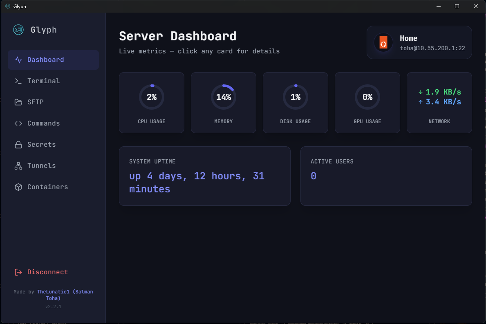

<table style="border: none; border-collapse: collapse; width: 100%;">
  <tr style="border: none;">
    <td width="140" align="center" valign="middle" style="border: none; padding-right: 20px;">
      <a href="https://github.com/TheLunatic1/Glyph">
        
      </a>
    </td>
    <td valign="middle" style="border: none;">
      <h1 style="margin: 0; font-size: 40px; border-bottom: none;">Glyph</h1>
      <p style="margin: 6px 0 0 0; font-size: 18px;"><strong>A Sleek, Modern, Agentic SSH & Server Management Client</strong></p>
      <p style="margin: 6px 0 0 0; color: #888;"><em>An all-in-one desktop workspace built for speed, security, and elegance.</em></p>
    </td>
  </tr>
</table>

<br />

<div align="center">
  
</div>

---

## 🚀 Overview

**Glyph** is a state-of-the-art desktop application designed to modernize remote server management. Discarding clunky, dated terminal interfaces, Glyph serves as a unified command center for sysadmins, developers, and DevOps engineers. Whether you are monitoring real-time system metrics, managing Docker containers, transferring files over SFTP, opening SSH port tunnels, or dropping into an unrestricted terminal, Glyph delivers a responsive, dark-mode-first glassmorphism experience.

## ✨ Features

- **🔒 Secure Server Vault:** Save, organize, and manage multiple remote SSH configurations securely on your local machine with support for SSH keys and password authentication.
- **🌐 ZeroTier Native P2P Integration:** Connect seamlessly to servers inside private ZeroTier networks natively via `libzt`—without needing the ZeroTier desktop client installed on your host operating system.
- **⚡ In-App Auto-Updating:** Integrated background update checker with real-time download progress tracking, markdown release note viewer, and one-click in-place restart & install.
- **📊 Live System Dashboard:** Real-time visual metrics for CPU utilization, Memory usage, Disk I/O, Network traffic, uptime, and system load parsed directly from your server.
- **💻 Full-Featured SSH Terminal:** A lightning-fast, `xterm.js`-powered terminal emulator providing unrestricted shell access, multi-tab support, and custom font resizing.
- **📁 Visual SFTP File Manager:** Browse, upload, download, rename, delete, and inspect file permissions with an intuitive, interactive dual-pane-style file manager.
- **🐳 Docker Container Management:** Instantly list, start, stop, restart, inspect real-time logs, and remove Docker containers right from the GUI without typing CLI commands.
- **📜 Command Snippets Library:** Save, tag, categorize, and execute your most frequently used shell commands across any connected server with a single click.
- **🔗 SSH Port Tunnels:** Easily configure and manage local and remote SSH port forwarding to securely tunnel databases, web applications, or internal services.
- **🔑 Secure Secrets Manager:** Store sensitive environment variables, API keys, and credentials encrypted and organized within your workspace.
- **🐧 Intelligent OS Detection:** Automatically detects your remote server's Linux distribution (Ubuntu, Debian, CentOS, Alpine, Arch, etc.) and displays the corresponding Devicon/Lucide badge.

## 📥 Download & Install

Getting started with Glyph is fast and simple—no command-line tools or dependency compilation required!

1. **Download the Latest Release:**
   Visit the official [GitHub Releases](https://github.com/TheLunatic1/Glyph/releases/latest) page and download the package for your operating system:
   - **Windows:** Download `Glyph-Setup-x.x.x.exe` *(Recommended for automatic background updates)* or the standalone portable executable `Glyph-Portable-x.x.x.exe`.
   - **Linux:** Download `Glyph-x.x.x.AppImage`.
   - **macOS:** Download `Glyph-x.x.x.dmg`.

2. **Run Glyph:**
   Launch the application and immediately start adding your remote SSH servers or ZeroTier networks!

3. **In-App Auto-Updating:**
   Glyph checks for updates automatically in the background. Whenever a new release is published, an interactive banner appears at the top of your app allowing you to read changelogs, download, and upgrade in place with one click.

> [!NOTE]
> **Important Note for Windows Users (Microsoft Defender SmartScreen):**
> Because Glyph is an open-source application built without a paid corporate code-signing certificate, Windows Defender SmartScreen may display a *"Windows protected your PC"* popup when launching the installer or updating.
> 
> To proceed safely, simply click **More info** (under the text) → then click **Run anyway**. Glyph is 100% clean, transparent, and open-source!

## 🛠 Tech Stack

Glyph is engineered using a robust, modern technology stack:

- **Framework:** [Electron](https://www.electronjs.org/) for high-performance cross-platform desktop capabilities.
- **Frontend UI:** [React 18](https://reactjs.org/) + [Vite](https://vitejs.dev/) for lightning-fast HMR and optimized production bundles.
- **Styling:** [Tailwind CSS](https://tailwindcss.com/) featuring a curated dark-mode glassmorphism design system with custom HSL tokens.
- **SSH Protocol:** `ssh2` & `ssh2-sftp-client` for reliable, low-level shell communication and file transfers.
- **Terminal Emulator:** `xterm.js` and `xterm-addon-fit` for pixel-perfect terminal rendering.
- **Networking:** `libzt` (ZeroTier Sockets) for native peer-to-peer networking.
- **Markdown & UI:** `marked` for release note rendering, [Lucide React](https://lucide.dev/), and [Devicon](https://devicon.dev/).

## 🛠 Building from Source (For Developers)

If you would like to contribute or run Glyph locally from source code:

```bash
# 1. Clone the repository
git clone https://github.com/TheLunatic1/Glyph.git
cd Glyph

# 2. Install dependencies
npm install

# 3. Start the development server
npm run dev
```

## 🎨 UI & Aesthetics
Glyph was designed from the ground up to feel premium and state-of-the-art. We discarded generic, boring terminal layouts in favor of a **Dark Mode First** aesthetic featuring vibrant HSL accents, subtle micro-animations, glassmorphic cards, and responsive hover interactions. The goal is to make server administration not just a routine chore, but a seamless experience.

## 🤝 Contributing
Contributions, issues, and feature requests are welcome! Feel free to check the [issues page](https://github.com/TheLunatic1/Glyph/issues) if you want to contribute or report a bug.

## 📄 License
This project is licensed under the Apache License 2.0 - see the [LICENSE](LICENSE) file for details. 
Please note the attribution requirements specified in the [NOTICE](NOTICE) file.

---
<div align="center">
  <p>Made by <a href="https://github.com/TheLunatic1">TheLunatic1 (Salman Toha)</a></p>
</div>
